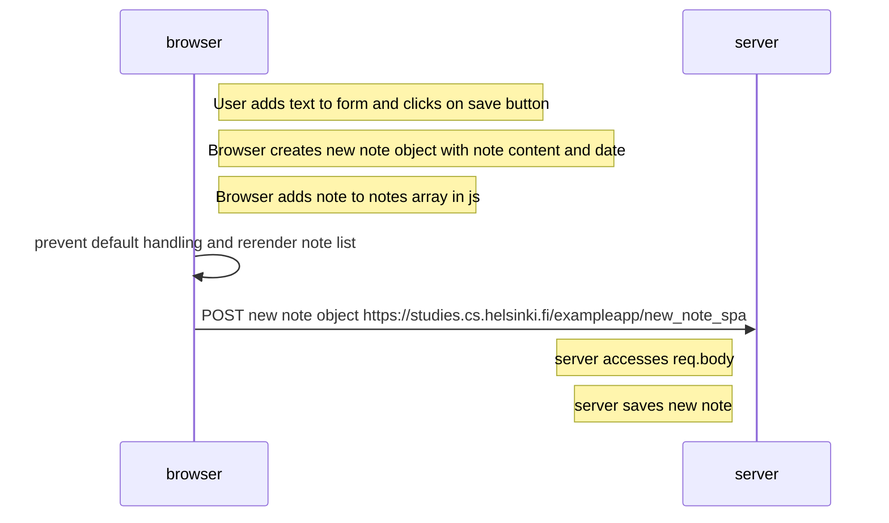

```mermaid
sequenceDiagram
    participant browser
    participant server

    Note right of browser: User adds text to form and clicks on save button
    Note right of browser: Browser creates new note object with note content and date
    Note right of browser: Browser adds note to notes array in js
    browser->>browser:prevent default handling and rerender note list


    browser->>server: POST new note object https://studies.cs.helsinki.fi/exampleapp/new_note_spa
    activate server
    Note left of server: server accesses req.body
    Note left of server: server saves new note
```
